<h1 align="center">ART CV 🎨</h1>

<p align="center">
  <b>The All-in-One Computer Vision & Pro-Grade Creative Studio</b><br>
  <i>Transform photos, videos, and GIFs into breathtaking artwork, erase unwanted objects, trim timelines, and compose custom frames right in your browser!</i>
</p>

<p align="center">
  
  
  
  
</p>

<p align="center">
  
</p>

---

## 🌟 Have You Got a Hidden Artist Inside You? 🤩

Do you love playing around with photos and videos 👩‍🔬?  
Want to create eye-catching artwork for your website, social media, or portfolio without taking months to learn complex video editors?

**ArtisticCV (ArtCV)** brings Python 🐍 and OpenCV power to your fingertips! Experience **30 pro computer vision filters**, a **dual-pass AI object eraser**, **VivaCut/Premiere-style video timeline editing**, and **canvas dimension resizing**—all wrapped in a dark-mode web application and high-speed REST API!

<p align="center">
  
</p>

---

## ✨ Studio Key Features

| Feature | Description |
| :--- | :--- |
| 🎨 **30 CV Filters Suite** | Instagram & Snapchat filters (Clarendon, Valencia, Juno, Snapchat Beauty Glow, Neon Lens), Oil Painting, Sketch, Charcoal, Low Poly, Cartoon, Pop Art, Glitch, Anime, and more! |
| 🧽 **Dual-Pass AI Eraser** | Multi-Scale Telea + Navier-Stokes inpainting engine with adjustable search radius and edge mask dilation to cleanly erase unwanted objects and people. |
| 🖼️ **Frame Studio** | 8 Preset Frame Cards (Polaroid, Vintage Film Strip, Cyberpunk Neon, Gilded Gold Wood, Art Deco) plus a **Custom Repeated Pattern Border Generator**. |
| 🎥 **VivaCut / Premiere Video Timeline** | Multi-track video clip sequence timeline with dynamic playhead needle, timecode ruler ticks, split clip tool, and drag trim handles. |
| 📐 **Canvas Resizer Studio** | High-precision Lanczos4, Cubic, Bilinear, and Pixel Art resizing for both Photos and Videos/GIFs (Instagram 1:1, Story 9:16, YouTube 16:9). |
| ⚡ **FastAPI REST API** | Full OpenAPI / Swagger interface served live at `http://localhost:8000/docs` for seamless backend integration. |

---

## 🖼️ Visual Filter Demo Showcase

| Effect Name | Original Image 📸 | Output Art 🎨 |
| :---: | :---: | :---: |
| **Snapchat Beauty Glow** |  | 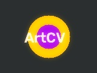 |
| **Instagram Clarendon** |  | 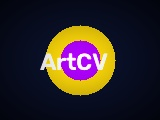 |
| **Oil Painting** |  |  |
| **Water Coloring** |  | 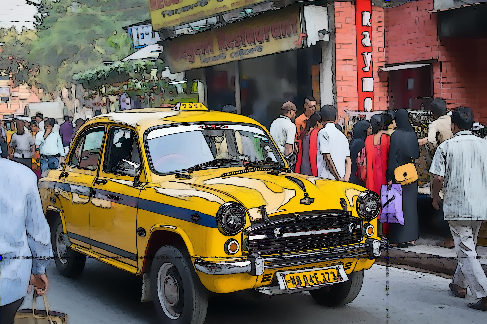 |
| **Pencil Sketch (B&W)** |  | 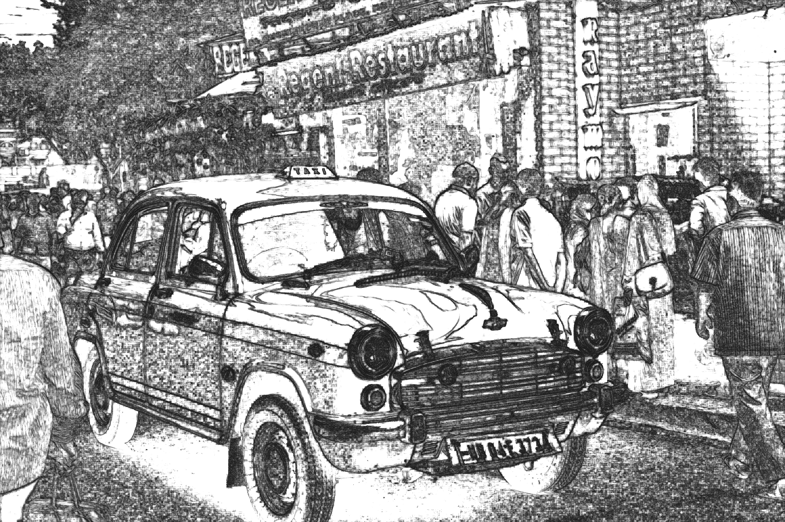 |
| **Cartoon Effect** |  | 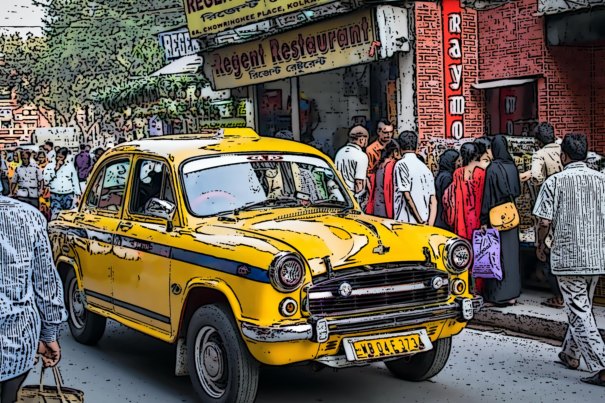 |
| **Comic Cartoon** |  | 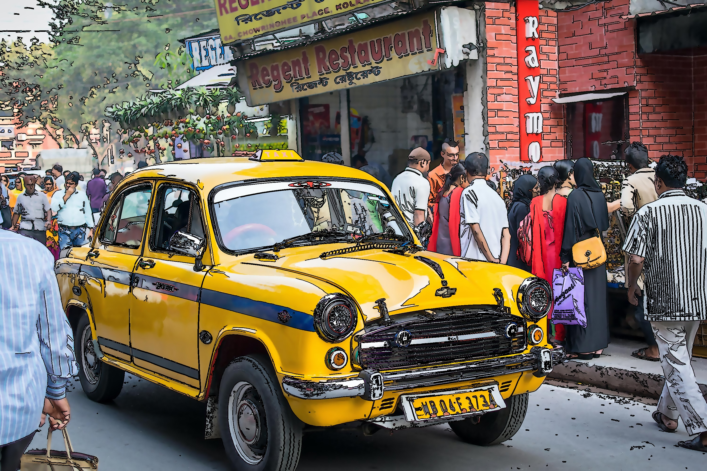 |
| **Low Poly** |  | 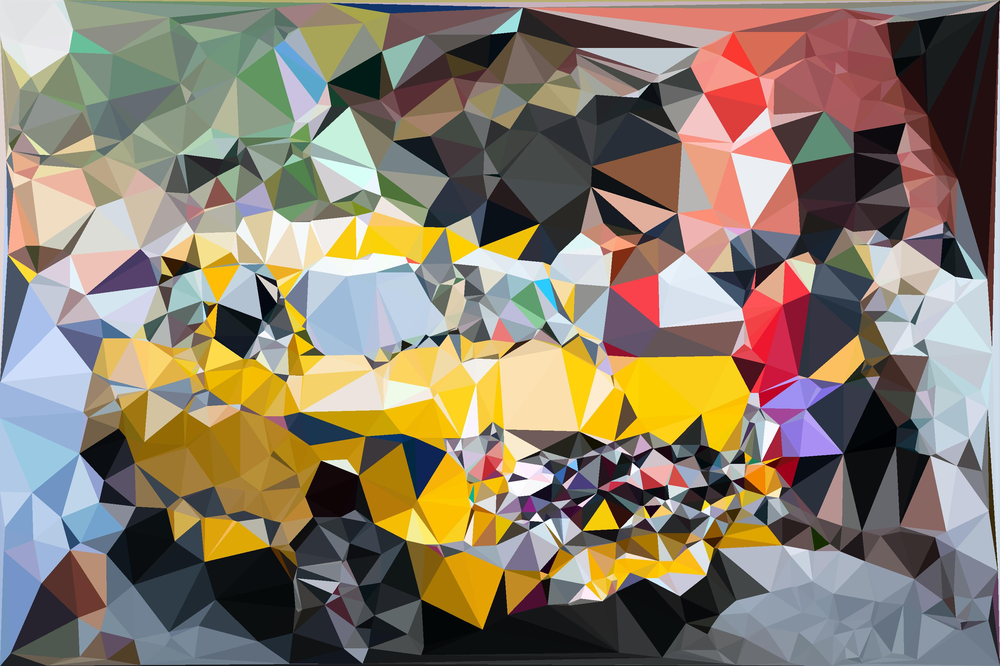 |
| **Sepia Effect** |  | 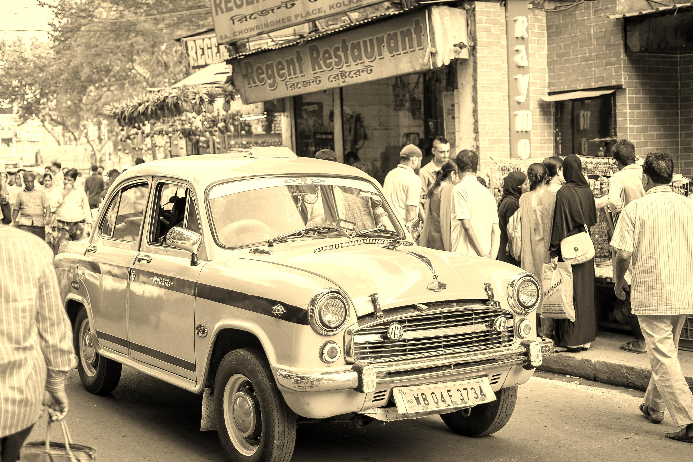 |
| **Pointillism** |  | 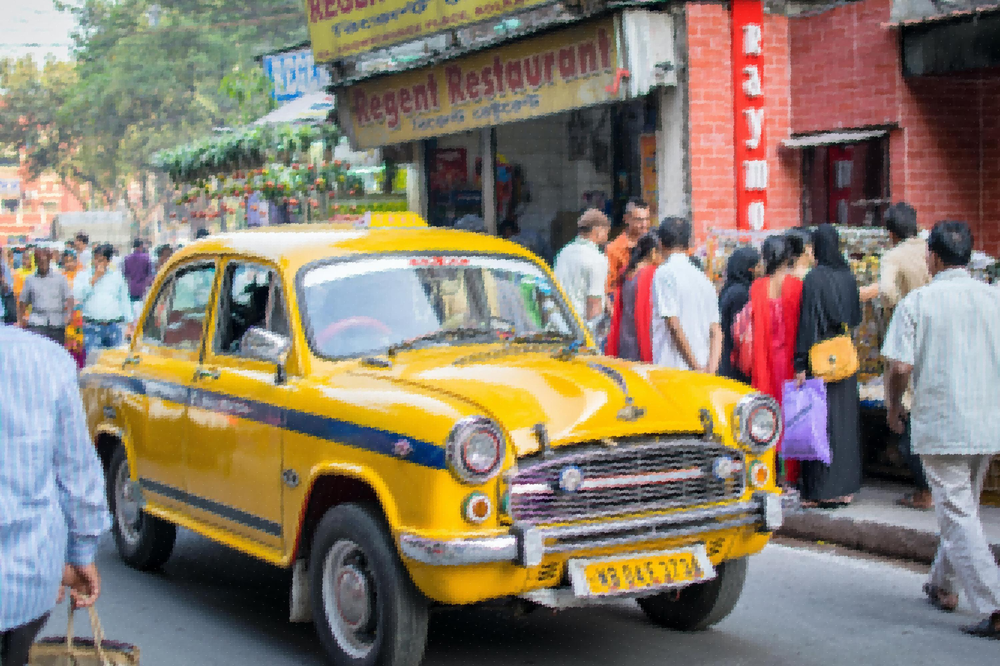 |
| **Glitch Art** |  | 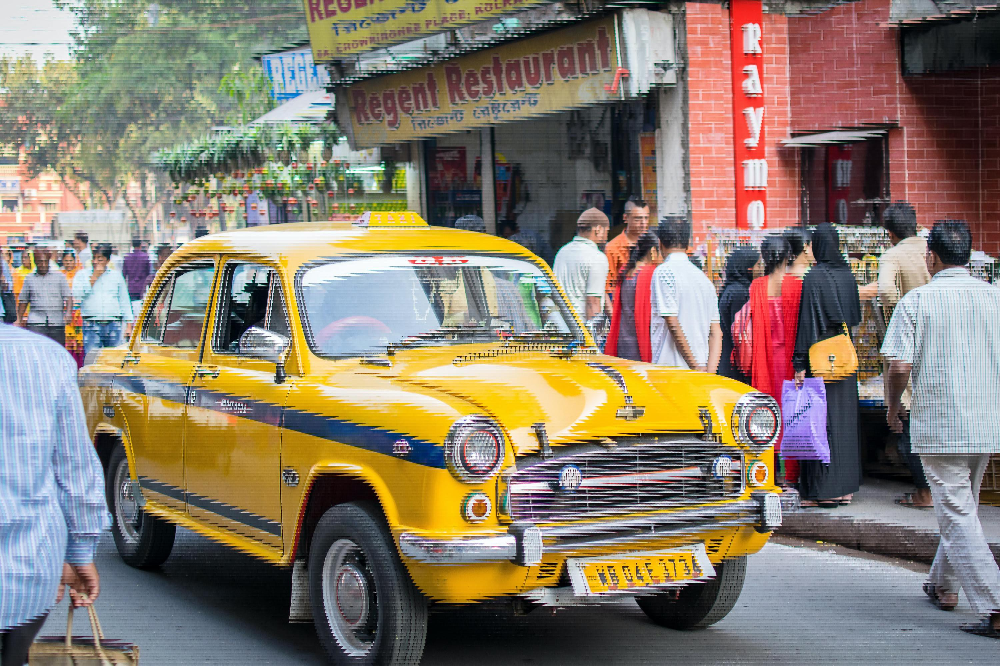 |
| **Negative Roll** |  | 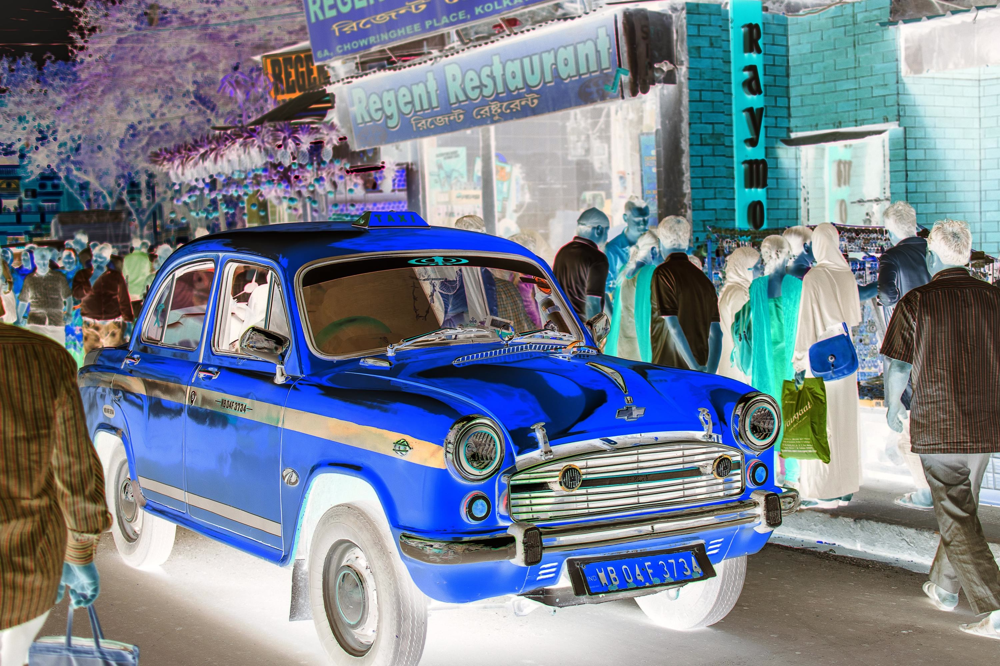 |

---

## ⚡ Quick Start & Installation

Convinced? Let's bring the magic to your local machine! 😉 ⚡

<p align="center">
  
</p>

### 1. Clone the Repository
```bash
git clone https://github.com/Aditya1791/Artistic-CV.git
cd Artistic-CV
```

### 2. Install Dependencies
```bash
pip install -r requirements.txt
```

### 3. Launch the Server & Web Studio UI
```bash
python server.py
```

### 4. Open in Your Browser
- 🎨 **Web Studio Dashboard**: Navigate to **[http://localhost:8000](http://localhost:8000)**
- ⚡ **Interactive REST API Docs**: Navigate to **[http://localhost:8000/docs](http://localhost:8000/docs)**

---

## 💻 REST API Endpoint Reference

| Endpoint | Method | Description |
| :--- | :---: | :--- |
| `/api/effects` | `GET` | Returns list of all 30 available filter effects and parameter schemas. |
| `/api/process` | `POST` | Processes image using selected filter effect and returns JPEG byte stream. |
| `/api/enhance` | `POST` | Adjusts brightness, contrast, saturation, sharpness, and warmth. |
| `/api/inpaint` | `POST` | Erases masked objects using dual-pass Telea/Navier-Stokes algorithms. |
| `/api/frame` | `POST` | Applies preset border frames (Polaroid, Film, Neon, Gold, Art Deco). |
| `/api/pattern-frame` | `POST` | Tiles custom uploaded pattern stamps repeatedly around border with spacing. |
| `/api/resize` | `POST` | Resizes photo canvas with Lanczos4, Cubic, Bilinear, or Nearest interpolation. |
| `/api/resize-video` | `POST` | Resizes video or GIF files to target resolution (1080x1920, 1920x1080). |
| `/api/process-video` | `POST` | Frame-by-frame video/GIF filter synthesis with timed sticker overlays. |
| `/api/process-video-sequence` | `POST` | Concatenates & trims multi-clip video sequences with filter synthesis. |

---

## 📜 License & Acknowledgments

Distributed under the **MIT License**. See `LICENSE` for more information.

<p align="center">
  
</p>

- Sample demonstration photos obtained from [Unsplash](https://unsplash.com).
- Special thanks to the computer vision community and OpenCV contributors.